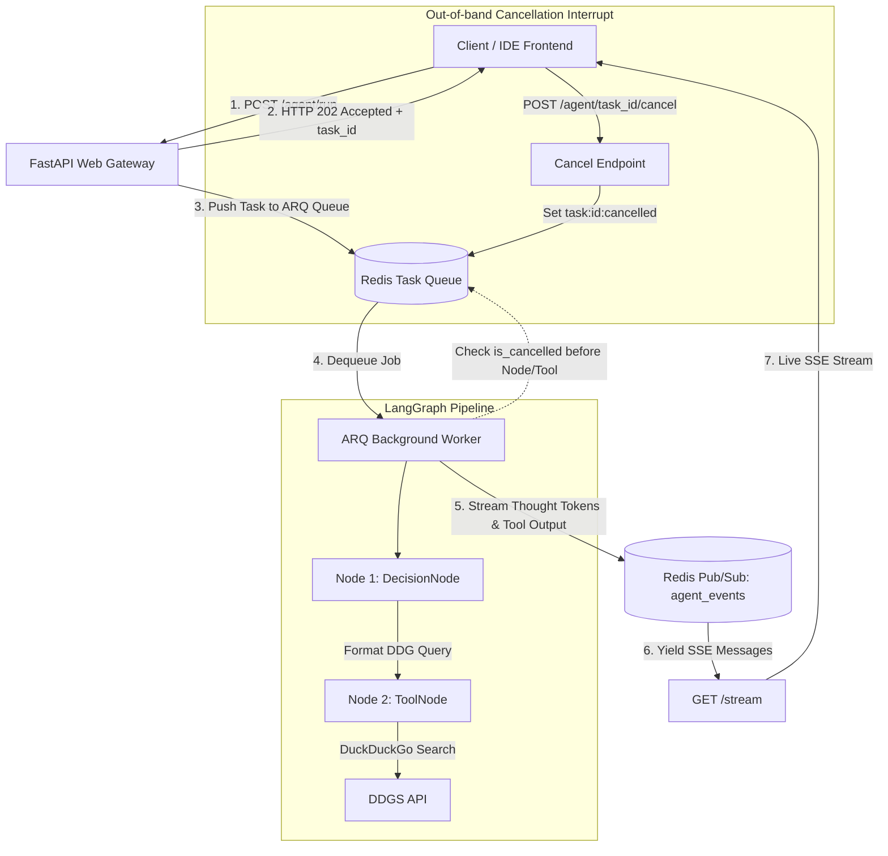

# Asynchronous Agent Microservice Core Engine

[](https://www.python.org/)
[](https://fastapi.tiangolo.com/)
[](https://www.docker.com/)
[-success.svg)](https://docs.pytest.org/)

A high-performance, decoupled asynchronous microservice engine for long-horizon AI coding agents. Built with FastAPI, Redis Pub/Sub, ARQ background workers, LangGraph state machines, Server-Sent Events (SSE), and Pydantic validation.

<p align="center">
  
</p>

---

## 🏗️ System Architecture



---

## ⚡ The Core Problem Solved

Synchronous HTTP request-response architectures fail for long-horizon autonomous AI agents for three fundamental reasons:

1. **504 Gateway Timeouts & Connection Drops**: Complex agent execution pipelines (planning, static analysis, code generation, test execution) take anywhere from 10 seconds to several minutes. Synchronous HTTP connections drop or time out at load balancers (Cloudflare, NGINX, AWS ALB).
2. **Worker Thread Starvation & CPU Saturation**: Holding HTTP worker threads open while an AI agent waits for LLM API responses or terminal execution locks up server threads, quickly reducing server throughput to zero.
3. **Lack of Resumable & Cancellable State Management**: Without an out-of-band task queue and event bus, user cancellations leave orphan background processes running indefinitely, consuming expensive LLM tokens and CPU cycles.

---

## 📊 Verified Benchmark Results

Load test simulation executed with 50 concurrent active users holding persistent SSE streams while firing continuous agent task requests:

| Benchmark Metric | Verified Value | Notes / Description |
| :--- | :--- | :--- |
| **Concurrent Active Streams** | **50 Users** | Persistent open SSE stream connections |
| **Total Requests Executed** | **1,346 Req** | High-concurrency task dispatch |
| **Throughput (RPS)** | **446.50 req/sec** | Serves over 440 req/sec concurrently |
| **Ingestion Latency (p95)** | **0.88 ms** | `POST /agent/run` responds in < 1 ms |
| **Baseline Memory Usage** | **57.19 MB** | Initial idle memory footprint |
| **Peak Memory Under Load** | **139.93 MB** | Delta: +82.73 MB (~1.65 MB per open stream connection) |

---

## 🚀 Local Quickstart

Get the entire stack (FastAPI Gateway, ARQ Worker, and Redis) running locally in seconds with Docker Compose:

```bash
# 1. Clone the repository
git clone https://github.com/adexxhh/autonomous-code-editor.git
cd autonomous-code-editor

# 2. Configure environment variables
cp .env.example .env

# 3. Spin up the container stack
docker compose up --build
```

Access the interactive web UI at **[http://localhost:8000](http://localhost:8000)**.

---

## 🔌 API Endpoint Specification

### 1. `POST /agent/run`
Submits a task to the background worker queue. Returns **HTTP 202 Accepted** immediately.
* **Request Payload**: `{"prompt": "Search for FastAPI SSE best practices"}`
* **Response (HTTP 202)**:
```json
{
  "status": "queued",
  "task_id": "a3c528c2-379c-4ac8-9be4-3f2aa8600bb6",
  "message": "Task enqueued for processing: Search for FastAPI SSE best practices"
}
```

### 2. `GET /stream`
Server-Sent Events (SSE) endpoint streaming real-time thought tokens, tool execution outputs, and pipeline completion status. Handles client disconnects cleanly without resource leaks.

### 3. `POST /agent/{task_id}/cancel`
Out-of-band cancellation trigger. Registers an `is_cancelled` flag in Redis. The LangGraph worker interrupts execution before the next node/tool run and emits a final `{"status": "cancelled"}` event.

---

## 🧪 Evaluation Test Suite

The repository includes a dedicated `pytest` evaluation test suite ([tests/test_agent_evals.py](file:///c:/Users/Asus/OneDrive/Desktop/autonomous-code-editor/tests/test_agent_evals.py)) verifying 5 edge-case prompts:

```bash
# Run pytest evaluation suite
.venv\Scripts\python -m pytest tests/test_agent_evals.py -v
```

### Strict Assertions Enforced:
1. **Tool Schema Selection**: Validates tool inputs against Pydantic `SearchToolInput` schema.
2. **Step Bound Guarantee**: Asserts execution steps `steps_count <= 4`.
3. **Zero Schema Hallucinations**: Validates outputs strictly against Pydantic `AgentOutput` schema.
